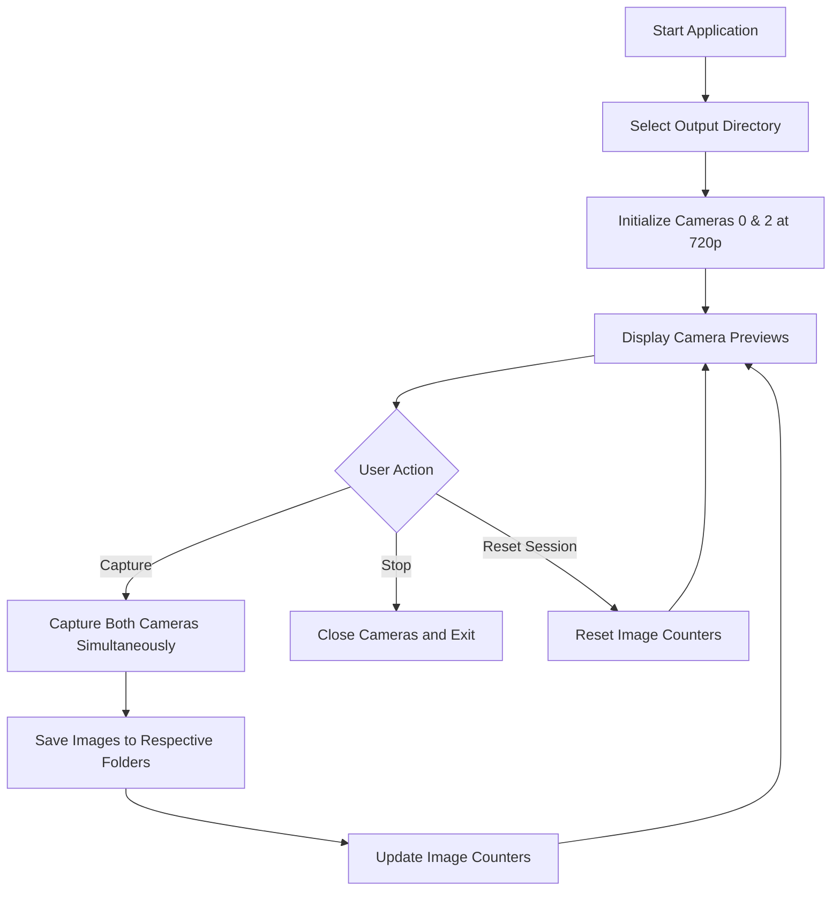

# Dual-Camera Wood Panel Capture Application

## Overview
This Python application provides a GUI-based solution for capturing images from two cameras simultaneously:
- Camera 0: Top Panel of Wood
- Camera 2: Bottom Panel of Wood

Images are saved to categorized folders with timestamped filenames for easy organization and tracking.

## Requirements
- Python 3.7+
- PyQt5 for GUI
- OpenCV for camera handling
- Windows-compatible for testing, Raspberry Pi-ready for deployment

## Key Features
- PyQt5 GUI with directory selection
- Real-time camera previews
- Simultaneous capture from both cameras
- Automatic folder creation (Top_Panel, Bottom_Panel)
- Timestamped filenames: `{category}_{YYYYMMDD}_{HHMMSS}_{000}.jpg`
- Persistent image numbering across sessions (continues from highest existing number in output folders, regardless of date)
- 720p resolution (1280x720) for both cameras

## Application Workflow


## Project Structure
```
pythoncapture/
├── main.py                 # Main application file
├── gui.py                  # PyQt5 GUI components
├── camera.py               # Camera handling logic
├── file_handler.py         # File saving and naming logic
├── requirements.txt        # Python dependencies
└── plan.md                 # This project documentation
```

## Todo List
- [ ] Set up project directory structure in pythoncapture/
- [ ] Create requirements.txt with dependencies (opencv-python, PyQt5)
- [ ] Design PyQt5 GUI layout with directory selection, capture buttons, and status display
- [ ] Implement camera initialization for indices 0 (Top) and 2 (Bottom) at 1280x720 resolution
- [ ] Add camera preview functionality in GUI
- [ ] Implement capture logic for both cameras simultaneously
- [ ] Create folder structure: Top_Panel and Bottom_Panel in selected directory
- [ ] Implement filename generation with date_time_imagenumber format
- [ ] Add session management (persistent image counter across sessions)
- [ ] Integrate all components into main application
- [ ] Test application on Windows with available cameras
- [ ] Document Raspberry Pi deployment considerations

## Dependencies
```
opencv-python==4.8.0.76
PyQt5==5.15.9
```

## Usage Instructions
1. Install dependencies: `pip install -r requirements.txt`
2. Run the application: `python main.py`
3. Select output directory using the GUI
4. Click "Start Capture" to begin camera preview
5. Use "Capture" button to take simultaneous photos
6. Images will be saved automatically to Top_Panel/ and Bottom_Panel/ folders

## Raspberry Pi Deployment Notes
- Ensure camera indices match (0 for Top, 2 for Bottom)
- Install OpenCV with camera support: `sudo apt-get install python3-opencv`
- May need to adjust camera settings for Raspberry Pi camera modules
- Test camera access permissions